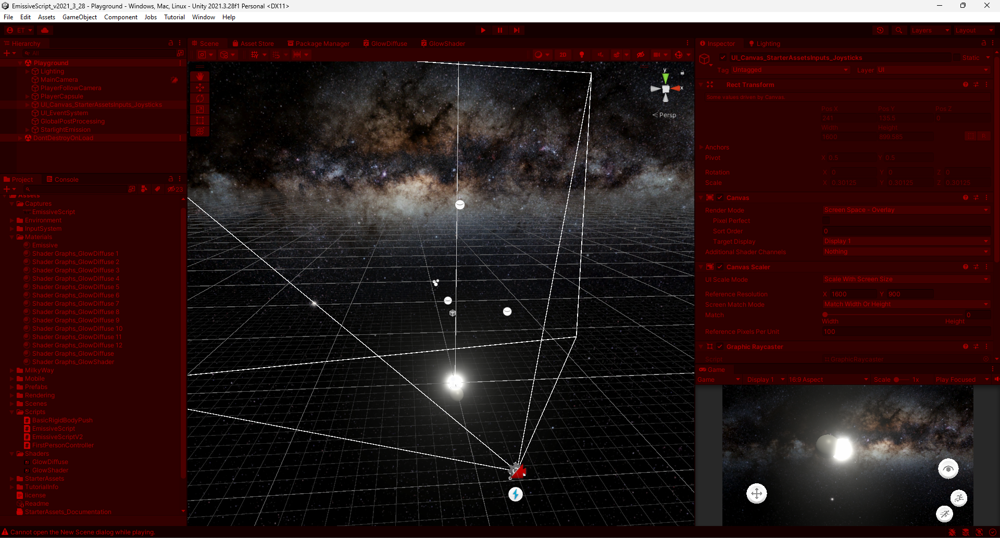

# EmissiveScript

Se trata de un script que intenta replicar el brillo de un objeto. En este caso es un objeto con un script que recibe un material, el objeto mesh render de la esfera y un valor flotante para la intensidad.

Se instancia el material del objeto para obtener el valor del color de la propiedad "_EmissionColor".
Al actualizarse se setea el color multiplicado por la intensidad a dicha propiedad y se espera que la intensidad cambie mediante algún evento o control de la interfaz.

## Dependencioas

Este proyecto lleva instaladas los paquetes del My Assets en el Package  Manager.

- [Milky Way Skybox](https://assetstore.unity.com/packages/2d/textures-materials/milky-way-skybox-94001) 
- [StarterAssets - FirstPerson | Updates in new CharacterController package](https://assetstore.unity.com/packages/essentials/starterassets-firstperson-updates-in-new-charactercontroller-pac-196525) 
